# Offline LSC Smart Connect Intelligenter Stecker

**Den Stecker im geöffneten Zustand niemals in eine Steckdose stecken. Der Umbau erfolgt nur unter Verwendung von einer 3.3V Spannungsquelle.  
⚠️Achtung, unsachgemäße Verwendung von Strom tötet!⚠️**

# Beschreibung

Im Action-Markt wird ein WALN Zwischenstecker mit Energie-Monitoring-Funktion von LSC angeboten, welcher sich mit ein wenig Bastelei von der Cloud entkoppel lässt.  
https://www.action.com/de-de/p/3202087/lsc-smart-connect-intelligenter-stecker/

In der Vergangenheit ließen sich viele vergleichbare Geräte z.B. mit der großartigen Tasmota Firmware befreien und ohne Cloudzugriff nutzbar machen, dass setzt aber einen  ESP8266 Chip vorraus, welcher bei dem LSC Stecker fehlt. Stattdessen setzt LSC auf einen Chip von Tuya und hier im Konkretem auf den BK7231N. 
Zum Glück gibt es inzwischen eine vergleichbare alternative Firmware für diese Tuya-Chips.

https://github.com/openshwprojects/OpenBK7231T_App

Auf dieser Seite wird beschrieben, wie diese Firmware auf die Stecker kommt und was die richtige Grundeinstellung ist.


# Der Umbau
## Gehäuse öffnen
Im ersten Schritt muss der Zwischenstecker geöffnet werden. Das gelinkt mit einem flachen Schraubendreher oder etwas Ähnlichem. Die folgenden zwei Bilder zeigen den Mechanismus im Gehäuse und mit sanftem Druck gelingt es ohne Beschädigungen.

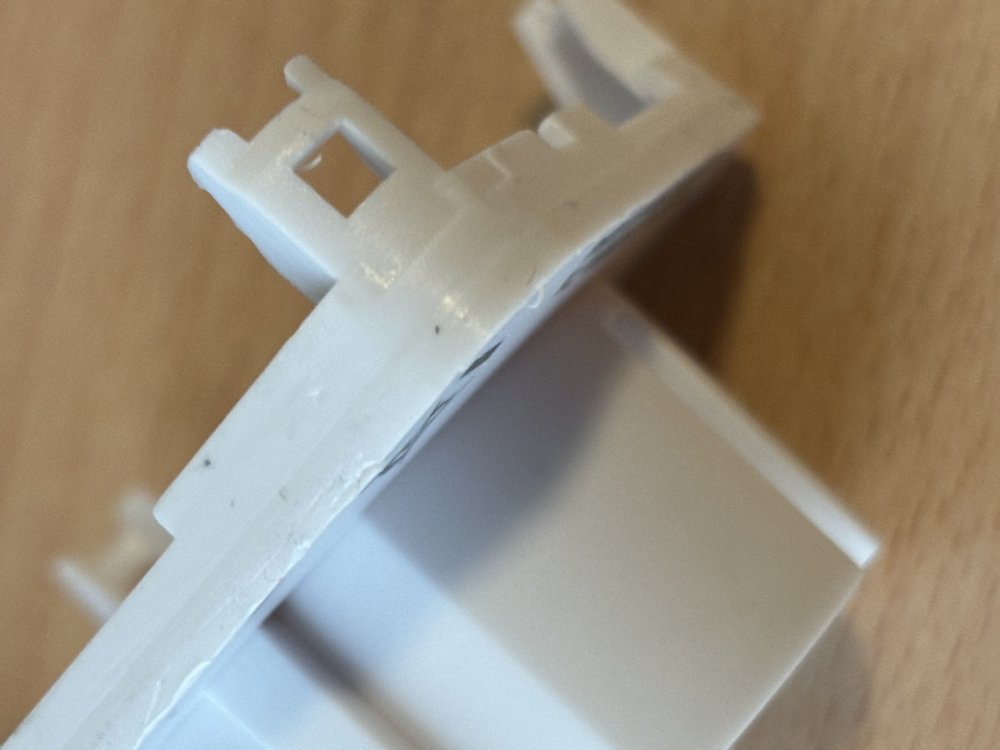
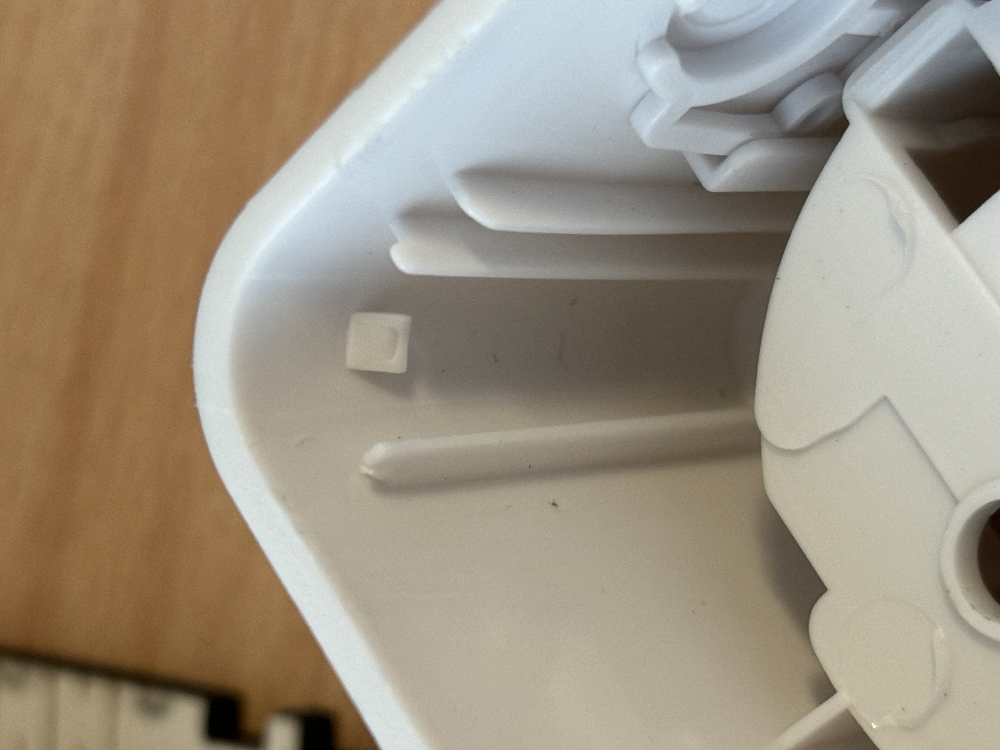

## Verbindung zum Computer herstellen
Der Tuya-Chip wird relativ einfach über eine serielle Verbindung auf die alternative Firmware umprogrammiert. Im einfachsten Fall kann das direkt im verbautem Zustand mit 4 Lötverbindungen und irgend einer UART Bridge / Serieller Konverter, welche 3.3V unterstützt, erfolgen. Außerdem braucht man eine 3.3V Spannungsquelle umd den Chip während des Flashvorgangs mir Strom zu versorgen. 

**Die 3.3V auf dem Adapter sind hierzu leider nicht geeignet, diese dienen nur zum Umschalten der Spannung zwischen 3.3 und 5V**

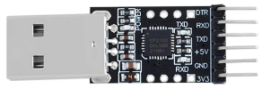


Für mich am einfachsten war es, stattdessen eine NodeMCU zu verwenden, welche sowieso in meiner Bastelkiste lag. Dortkann man dort eine Verbindung zwischen dem EN-PIN und GND herstellen, den ESP temporär deaktivieren und kann dann den dort verbauten Konverter nutzen sowie die passende 3.3V Spannungsquelle nutzen. Als serielle Pins werden RX0/TX0 direkt via USB nutzbar.


*Wer gern lötet kann auch noch eine 5. Leitung an das CEN-PAD des Tuya löten, um via Software ein Reset ausläsen zu können. Das ist aber aus meinen Augen nicht notwendig, da man mit dem FlashTool und dem Retry beim Connect sehr einfach die Power-on Prozedur händisch umsetzen kann.*


Die Belegung des Tuya ist aufgedruckt  
```
VCC GND RX1 TX1 P24 P26
##  ##  ##  ##  ##  ##
######################
```
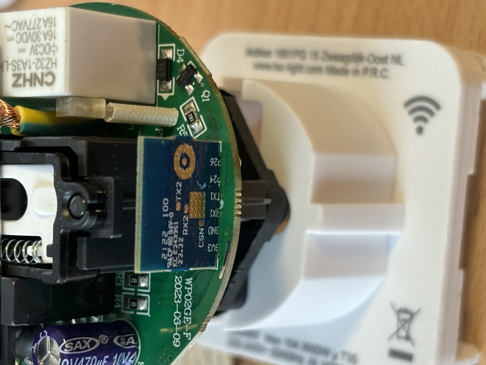

Verlötet, wenn man das im Auslieferungszustand so nennen kann, ist der Chip auf der Rückseite.

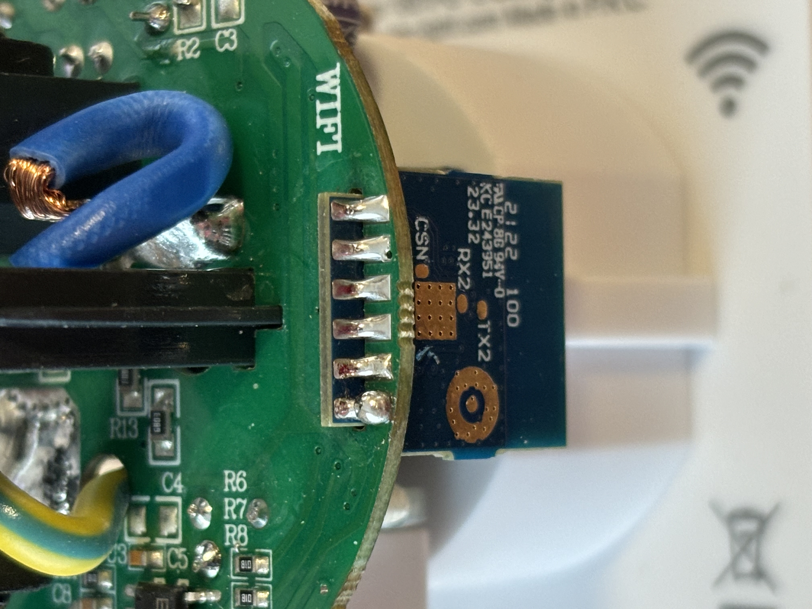

Die Aufgabe ist es die Verbindungen zur UART-Bridge erzustellen. Dazu verbindet man einfach:

| Tuya | Adapter |
|------|---------|
|  VCC | 3.3V    |
|  GND | GND,  lose Verbindung, die manuell gesteckt wird um Reset auslösen zu können     |
|  RX1 | TX0     |
|  TX1 | RX0     |

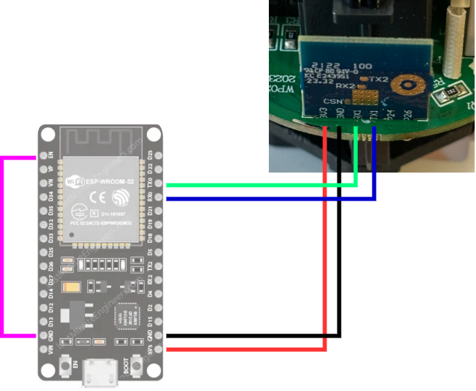

Der Tuya ist mit der Hauptplatine verbunden und die notwendigen Pins werden durch die Bauteile wahrscheinlich gestört (Interferenz). Ich **entlöte** bisher hierfür einfach den GND-Pin bevor ich die Verkabelung durchführe, sodass ein kleiner Spalt zwischen der MCU-Board und der Hauptplatine entsteht. Nach dem Entlöten kann man das auch schnell mit einem Durchgangsprüfer checken. Bei Anlöten der GND-Verbindung bitte darauf achten, dass die an den Tuya und nicht das Hauptboard gelötet wird.
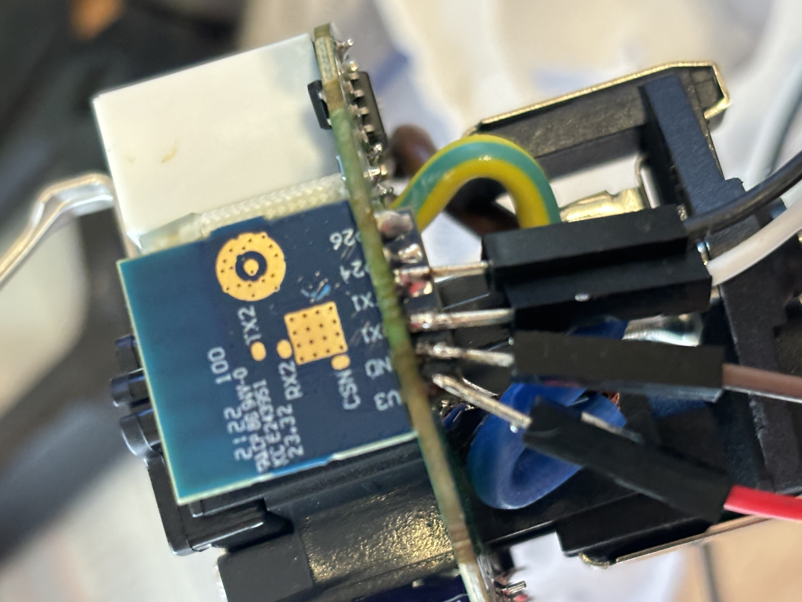

Wenn das erledigt die GND-Verbindung noch geöffnet und die Verbindung zum Computer hergestellt ist, geht es an die Software.

## Software sichern und OpenBK einspielen

Die notwendige Software findet man hier:
https://github.com/openshwprojects/BK7231GUIFlashTool

Nachdem Start muss der richtige UART Port eingestellt werden. Als Chip wählt man den **BK7231N** und kann auch gleich die aktuellste Version der Firmware über die entsprechende Schaltfläche herunterladen.

Als nächsten Schritt startet man über "Do backup and flash new" den Prozess und sobald die Meldung "Getting bus failed..." auftaucht verbindet man die GND-Verkabelung und startet den Tuya Chip. Danach sollte der Bootloader starten, die Verbindung zum Tool hergestellt und ein Backup gezogen werden-
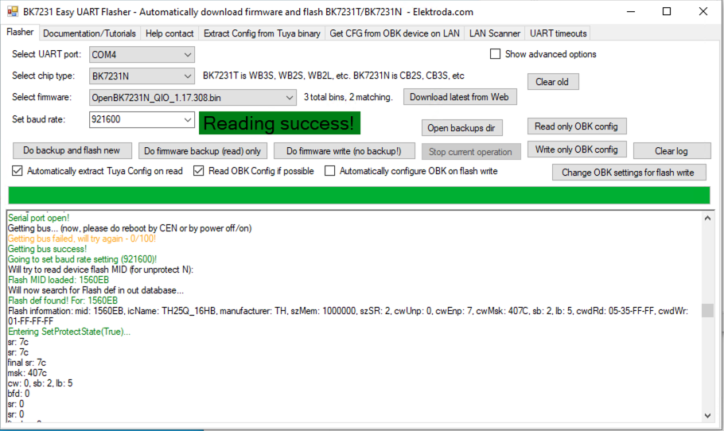


Direkt im Anschluss wird die ausgelesene Konfiguration angezeigt.

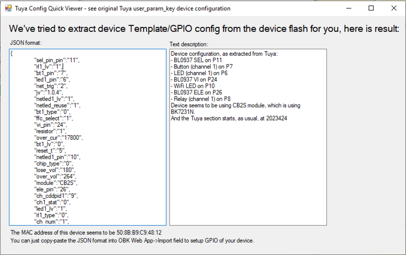

Es erfolgt der Flashvorgang und im normal Fall ist der Hauptteil abgeschlossen.
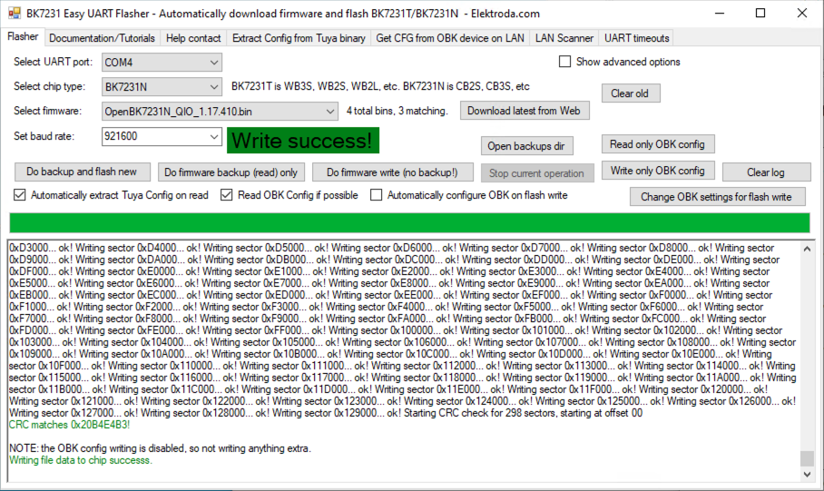

Im geöffneten Zustand trennt man die GND-Verbindung und Verbindet sie direkt wieder, um einen Reset durchzuführen. Nun sollte im WLAN ein ein neuer Accesspoint "OpenBK..." auftauchen.

## OpenBK einstellen

Nach dem ersten Start wird ein WLAN Access Point verfügbar, auf den man sich ohne Passwort verbindet und dann im Browser auf folgende URL navigiert:  

http://192.168.4.1/index

Über die Oberfläche wird die richtige WIFI-Verbindung eingerichtet und der Stecker neu gestartet. Im Anschluss ist das Gerät im eigenen Netz verfügbar und kann über die vergebene IP angesprochen werden.

Wenn das funktioniert hat, wird die Grundkonfiguration, passend zum LSC-Stecker, durchgeführt. Dies erreicht man über "Config" -> "Configure Module" oder direkt:   
http://ip_des_steckers/cfg_pins  

| Name | Funktion |
|------|---------|
|  P6 (PWM0) | LED    |
|  P7 (PWM1) | Btn    |
|  P8 (PWM2) | Rel    |
|  P10 (RXD1) | WifiLED    |
|  P11 (TXD1) | BL0937SEL    |
|  P24 (PWM4) | BL0937CF1    |
|  P26 (PWM5) | BL0937CF    |
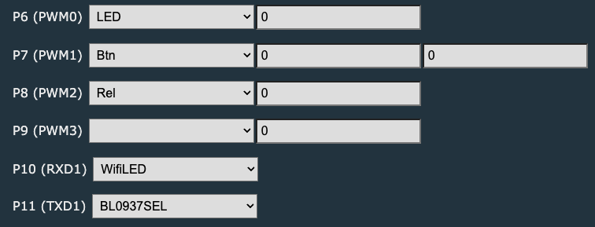
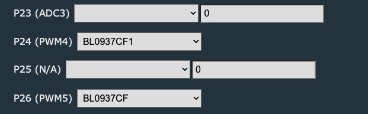

Danach kann die Verkabelung entfernt und der Stecker wieder zusammengebaut werden. Dabei bitte darauf achten, dass der Button auf der richtigen Seite ist. Ich habe hier nicht aufgepasst und musste das Gehäuse gleich nochmal öffnen.

https://github.com/tasmota/docs-8.1/blob/master/Power-Monitoring-Calibration.md


Um die Energieüberwachung zu nutzen, müssen der Sensor ggf. zunächst aktivieren werden. Das erfolgt über "Config->Execute custom command" und das Kommando:
```
startDriver BL0937
```
Damit die Messung auch korrekt ist, muss der Sensor kalibriert werden. Hierzu schließt man eine (widerstand) Last mit bekanntem Verbrauch (z.B. eine Glühbirne) an die Steckdose an. Die Werte sollten parallel mit einem anderen Energiemessgerät überprüfen werden. Nachdem derAusgang der Steckdose (Relais ein) aktiviert wurden, gibt man folgende Komanndos mit den korrekten **eigenen** Werten ein!:

```
SpannungSet 232.0
StromSet 0.475
LeistungSet 110.0
```

Alternativ zur Konsole, kann auch die WebApp verwendet werden. Dort gibt es einen komfortablen Weg die Kalibrierung unter "Tools" durchzuführen.  
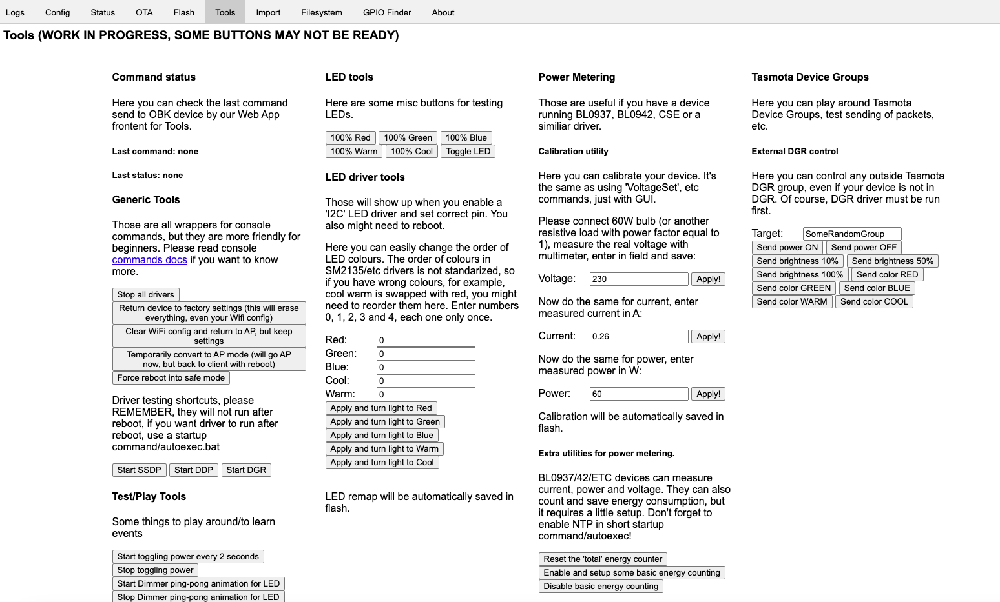

Danach ist die Grundeinrichtung abgeschlossen und man kann alle weiteren Einstellungen (z.B. eine MQTT-Verbindung)nach dem eigenen Bedarf durchführen.